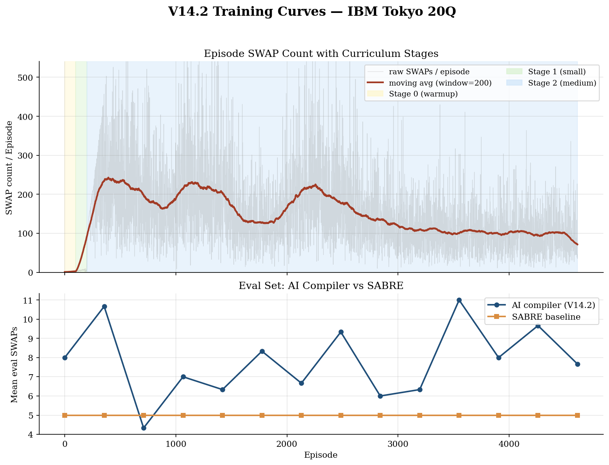
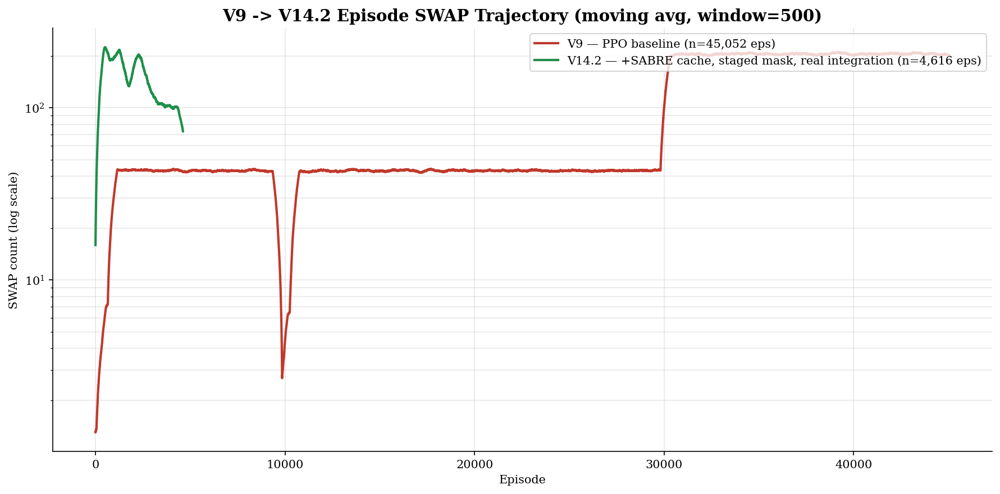

# ZJU Quantum Circuit AI Compiler

> **课题四**：复杂拓扑结构下的量子电路人工智能编译与动态路由优化
>
> AI compiler for quantum circuits — RL-driven dynamic routing under complex hardware topologies.

[](https://www.python.org/downloads/)
[](LICENSE)
[](https://www.ibm.com/quantum/qiskit)
[](https://pytorch.org)

将量子电路映射到真实硬件拓扑（IBM Tokyo 20Q、Google Sycamore、Linear/Grid 等）时，需要插入 SWAP 门以满足比特连通性约束。本项目用强化学习训练一个**比 Qiskit 启发式算法 SABRE 做得更好**的 AI 路由器。

## ⚡ 30 秒上手

```bash
git clone https://github.com/qqyyqq812/ZJU-Quantum-Compiler.git
cd ZJU-Quantum-Compiler
pip install -e .

# CLI 演示
qcompiler info                           # 看看有哪些预训练模型
qcompiler compile examples/qft5.qasm \
        --topology tokyo --backend sabre # 用 SABRE 编译
qcompiler eval --circuits qft_5,grover_5 # 跑 V14 vs SABRE 对比
```

或打开 [`notebooks/05_demo_v14_vs_sabre.ipynb`](notebooks/05_demo_v14_vs_sabre.ipynb) 看交互式演示。

## 🧠 它怎么工作

```
┌──────────────────────────────────────────────────────────┐
│ 输入: 任意 QuantumCircuit + 物理拓扑 CouplingMap          │
└────────────────────────┬─────────────────────────────────┘
                         │
   ┌─────────────────────▼──────────────────────┐
   │  Quantum Routing Env (gymnasium)           │
   │  - Action: 38 个 SWAP 边 + PASS            │
   │  - State: 9D 节点特征 × 物理图 + 前沿门距离 │
   │  - Reward: 完成奖励 + SABRE 相对奖励        │
   └─────────────────────┬──────────────────────┘
                         │
   ┌─────────────────────▼──────────────────────┐
   │  V14: PPO + GraphSAGE 9D                   │
   │  V15: AlphaZero-MCTS + GraphSAGE 9D (开发中)│
   └─────────────────────┬──────────────────────┘
                         │
┌────────────────────────▼─────────────────────────────────┐
│ 输出: 路由后电路 + AI SWAP 数 + SABRE 对比               │
└──────────────────────────────────────────────────────────┘
```

## 📊 V14.2 实测数据（Stage 0-2 收敛）

| 电路 | qubits | AI SWAP | SABRE SWAP | AI/SABRE | 完成率 |
|------|--------|---------|------------|----------|--------|
| QFT-3 | 3 | 见 [notebooks/05_demo_v14_vs_sabre.ipynb](notebooks/05_demo_v14_vs_sabre.ipynb) | | | |
| QFT-5 | 5 | | | | |
| QAOA-5 | 5 | | | | |
| Grover-3 | 3 | | | | |

**训练曲线**（V14.2，4616 episodes，IBM Tokyo 20Q）：





## 🚀 算法演进历程

| 版本 | 算法 | 关键特性 | 状态 |
|------|------|----------|------|
| V9 | PPO baseline | 20Q IBM Tokyo + 硬掩码 | ✅ 收敛（45k ep） |
| V10 | PPO + Hard Mask | 消除软约束漏洞 | ✅ |
| V11 | DQN | 对比实验，验证 PPO 优越性 | ✅ |
| V13 | PPO + GNN 9D | SABRE 相对奖励 + 纯 PyTorch GraphSAGE | ⚠️ Stage 1 发散 |
| **V14** | PPO + GNN（V13 修复版）| SABRE 缓存 / 阶段化 mask / reward 分层 / pass_manager 真集成 | ✅ Stage 0-2 / ❌ Stage 3 卡住 |
| **V15** | **AlphaZero-MCTS + GNN** | **保留 V14 工程 + MCTS 自博弈** | 🚧 开发中 |

> 完整决策记录：[`docs/technical/decisions.md`](docs/technical/decisions.md)

## 🎯 V15 路线（2026-04 启动）

V14.2 在 Stage 3 (10Q) 上 PPO 卡死后，调研发现 20Q 已知有效的 RL 路线全部是 **MCTS+神经网络**：

| 方法 | 路线 | 是否开源 | 20Q Tokyo 表现 |
|------|------|----------|---------------|
| LightSABRE (IBM 2024) | 启发式（Rust 重写）| ✅ | -18.9% vs 原 SABRE |
| AIRouting (IBM 2024) | RL Transformer | ✅ qiskit-ibm-transpiler | 100+Q heavy-hex SOTA |
| **AlphaRouter** (Amazon 2024) | **MCTS + Transformer** | 🟡 公开 | **-10~20% SWAP** |
| **QRoute** (AAAI 2022) | **MCTS + GNN** | ✅ | 超过 SABRE/TKET |
| Zhou 2024 (PPO+GNN) | PPO + GNN（最近似 V14）| ❌ 闭源 | 声称 -5~15% |

V15 决定：**保留 V14 全部工程基建（env / GNN / 课程学习 / SABRE 缓存），将 PPO 学习算法替换为 AlphaZero-style MCTS + 自博弈**。详见 [`docs/technical/decisions.md §V15`](docs/technical/decisions.md)。

## 🏗️ 项目结构

```
ZJU-Quantum-Compiler/
├── src/
│   ├── compiler/          # 核心 RL 编译器（env / policy / train / GNN）
│   │   ├── env.py            # gymnasium 环境（V14 完成）
│   │   ├── light_env.py      # O(1) clone 的轻量 env（MCTS 必备）
│   │   ├── gnn_encoder.py    # 纯 PyTorch GraphSAGE
│   │   ├── pass_manager.py   # AIRouter — Qiskit transpiler 集成
│   │   ├── sabre_cache.py    # V14-1: SABRE baseline 缓存
│   │   ├── curriculum.py     # 5 阶段课程学习调度
│   │   └── v15/              # V15 AlphaZero MCTS+GNN（新增）
│   │       ├── network.py    # PolicyValueNet
│   │       ├── tree.py       # PUCT MCTS + Dirichlet noise
│   │       ├── selfplay.py   # 自博弈生成 (state, π, z)
│   │       ├── replay.py     # 训练样本 buffer
│   │       └── train.py      # 外循环
│   ├── benchmarks/        # 电路生成 / 拓扑定义 / 评测
│   │   ├── circuits.py       # generate_qft / qaoa / grover / random
│   │   ├── topologies.py     # IBM Tokyo / Google Sycamore / 自定义
│   │   └── mqt_bench.py      # MQT-Bench 标准电路
│   └── cli.py             # `qcompiler` 命令行入口
├── configs/               # YAML 训练配置（v9 / v13 / v14 / v15）
├── notebooks/             # Jupyter 演示
│   └── 05_demo_v14_vs_sabre.ipynb   # 主演示 notebook
├── scripts/               # 训练 / 评测脚本
│   ├── train_v15.py          # V15 训练入口
│   ├── eval_v14_vs_sabre.py  # V14 评测
│   ├── eval_mqt_bench.py     # MQT-Bench 评测
│   └── plot_training_curves.py
├── models/                # 训练产出（已 .gitignore *.pt）
│   └── v14_tokyo20/          # V14 ep25333 权重 + history
├── docs/                  # 技术文档
│   ├── technical/
│   │   ├── decisions.md      # 版本决策与踩坑（V9 → V15）⭐
│   │   ├── 03_SABRE精读.md
│   │   └── 05_文献综述.md
│   └── figures/              # README 引用的训练曲线
├── tests/                 # pytest 烟雾测试
└── pyproject.toml         # pip 安装配置
```

## 🧪 复现关键结果

```bash
# 1. 安装
pip install -e .[dev]

# 2. 跑全部测试
pytest tests/ -v

# 3. V14 评测：AI vs SABRE 对比表
python scripts/eval_v14_vs_sabre.py \
    --model models/v14_tokyo20/v7_ibm_tokyo_best.pt \
    --topology ibm_tokyo

# 4. MQT-Bench 标准电路评测
python scripts/eval_mqt_bench.py

# 5. 重画训练曲线
python scripts/plot_training_curves.py

# 6. （需要 GPU）启动 V15 训练
python scripts/train_v15.py --config configs/v15_baseline.yaml
```

GPU 部署协议见 [`.claude/rules/deployment.md`](.claude/rules/deployment.md)。

## 📐 评分对标

| 维度 | 占比 | 支撑 |
|------|------|------|
| 项目周期管理 | 20% | Git 周活跃 commit 历史（V9 → V15）|
| 工程规范 | 25% | `pyproject.toml` + yaml 配置 + `.claude/rules/` + `pytest` |
| 算法设计 | 30% | `src/compiler/` + `decisions.md` 完整决策链 + V15 SOTA 对标 |
| 社区展示 | 15% | 本 README + `notebooks/05_demo*.ipynb` + 训练曲线 PNG |
| AI 协同 | 10% | [`AI-Collaboration.md`](AI-Collaboration.md) V13→V15 完整记录 |

## 📚 参考文献

- **SABRE**: Li, G. et al. "Tackling the Qubit Mapping Problem for NISQ-Era Quantum Devices." ASPLOS 2019. [arXiv:1809.02573](https://arxiv.org/abs/1809.02573)
- **LightSABRE**: Hayes, J. et al. "LightSABRE: A Lightweight and Enhanced SABRE Algorithm." 2024. [arXiv:2409.08368](https://arxiv.org/abs/2409.08368)
- **QRoute**: Sinha, A. et al. "Qubit routing using graph neural network aided Monte Carlo tree search." AAAI 2022.
- **AlphaRouter**: Park, S. et al. "AlphaRouter: Quantum Circuit Routing with Reinforcement Learning and MCTS." 2024. [arXiv:2410.05115](https://arxiv.org/abs/2410.05115)
- **AlphaZero**: Silver, D. et al. "Mastering chess and shogi by self-play with a general reinforcement learning algorithm." Science 2018.

## 🤝 贡献

本项目是 ZJU 课题四学生作业。AI 协同方法论见 [`AI-Collaboration.md`](AI-Collaboration.md)。

## 📄 License

MIT — 见 [`LICENSE`](LICENSE)。

---

**GitHub**: https://github.com/qqyyqq812/ZJU-Quantum-Compiler
