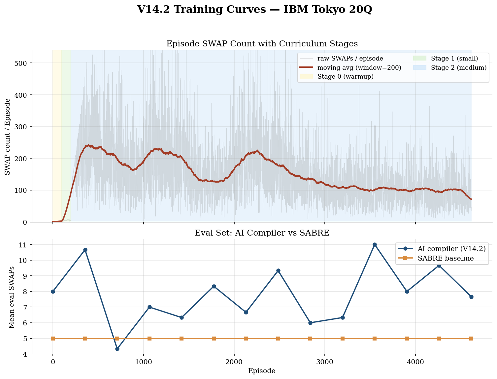

# ZJU Quantum Circuit AI Compiler

> A reproducible quantum circuit routing playground for comparing Qiskit SABRE
> with experimental RL/GNN-based AI routers on constrained hardware topologies.

[](https://www.python.org/downloads/)
[](LICENSE)
[](https://www.ibm.com/quantum/qiskit)
[](https://pytorch.org)

This repository studies how to map logical quantum circuits onto real hardware
topologies such as IBM Tokyo 20Q. The stable public path is SABRE-based
compilation. The AI router is included as an experimental research component:
the current V14/V15 checkpoints have **not** beaten SABRE on the latest P1
benchmark.

## Public playground

Open the static project page:

- GitHub Pages: `https://qqyyqq812.github.io/ZJU-Quantum-Compiler/`
- Local file: [`docs/index.html`](docs/index.html)

The page explains the project, shows example QASM circuits, lists the latest
V14 P1 benchmark table, and gives commands you can run locally. It works without
Python or a GPU. If you start the optional FastAPI server, the page can also
call your local compiler backend.

## 30-second local start

```bash
git clone https://github.com/qqyyqq812/ZJU-Quantum-Compiler.git
cd ZJU-Quantum-Compiler
pip install -e .[dev]

qcompiler info
qcompiler compile examples/qft5.qasm --topology tokyo --backend sabre
qcompiler eval --circuits qft_5,qaoa_5,ghz_5 --topology tokyo
```

Use the optional local API when you want the website to call a live backend:

```bash
uvicorn src.server.app:app --reload --port 8765
```

Then open [`docs/index.html`](docs/index.html) in a browser and use **Run with
local API**.

## What the project does

Quantum hardware only allows two-qubit gates between connected physical qubits.
When a logical circuit asks for a gate between distant qubits, the compiler must
insert SWAP gates. This project provides:

- a Qiskit SABRE baseline for reliable routing,
- an experimental `AIRouter` based on PPO/GNN training history,
- benchmark scripts for MQT-Bench-style circuits,
- a public playground and local API for examples,
- technical notes that document why each version changed.

```text
QuantumCircuit + CouplingMap
          |
          v
Routing environment and circuit DAG
          |
          +--> Qiskit SABRE baseline
          |
          +--> Experimental AIRouter checkpoint
          |
          v
Routed circuit or honest status: OK / INCOMPLETE / N/A
```

## Current benchmark status

The latest public P1 evaluation was generated on May 4, 2026 with
`models/v14_tokyo20/checkpoint_ep25333.pt` on the IBM Tokyo 20Q topology. The
main set covers `qft`, `qaoa`, `ghz`, and `vqe` circuits at 5, 10, and 20
qubits.

| Metric | Result |
| --- | --- |
| SABRE completion | 12/12 |
| AI completion | 4/12 |
| AI beats SABRE | 0/4 completed comparable rows |
| Mean AI/SABRE ratio | 2.500 on completed rows with SABRE > 0 |

Read the full report:
[`models/v14_tokyo20/eval_report_mqt.md`](models/v14_tokyo20/eval_report_mqt.md).
The machine-readable source is
[`models/v14_tokyo20/eval_report_mqt.json`](models/v14_tokyo20/eval_report_mqt.json).



## Examples

The checked-in examples are small enough to inspect and fast enough to run on
CPU:

| File | Purpose | Suggested command |
| --- | --- | --- |
| [`examples/qft5.qasm`](examples/qft5.qasm) | Dense QFT interactions | `qcompiler compile examples/qft5.qasm --topology tokyo --backend sabre` |
| [`examples/ghz5.qasm`](examples/ghz5.qasm) | Small entanglement chain | `qcompiler compile examples/ghz5.qasm --topology tokyo --backend sabre` |
| [`examples/qaoa5.qasm`](examples/qaoa5.qasm) | One QAOA-style layer | `qcompiler eval --circuits qaoa_5 --topology tokyo` |

Run an AI comparison when the V14 checkpoint exists locally:

```bash
qcompiler eval \
    --model models/v14_tokyo20/checkpoint_ep25333.pt \
    --circuits qft_5,qaoa_5,ghz_5 \
    --topology tokyo
```

The AI columns are diagnostic. `INCOMPLETE` means the route did not finish
within the configured step limit.

## Local API

Start the API:

```bash
uvicorn src.server.app:app --reload --port 8765
```

Useful endpoints:

| Endpoint | Description |
| --- | --- |
| `GET /api/status` | Version, topology aliases, model path, and AI load status |
| `GET /api/examples` | Public QASM example list |
| `POST /api/compile` | Compile an example or inline OpenQASM with `backend=sabre\|ai` |
| `GET /api/benchmarks` | Return the checked-in V14 P1 summary without rerunning it |

Example request:

```bash
curl -s http://localhost:8765/api/compile \
  -H 'content-type: application/json' \
  -d '{"example":"qft5","backend":"sabre","topology":"tokyo"}'
```

## Reproduce the P1 report

```bash
python scripts/eval_mqt_bench.py \
    --ai-model models/v14_tokyo20/checkpoint_ep25333.pt \
    --n-qubits 5,10,20 \
    --benchmarks qft,qaoa,ghz,vqe \
    --output models/v14_tokyo20/eval_report_mqt.md
```

For a shorter local evidence pack:

```bash
bash run_public_demo.sh
```

This writes to `results/public_demo/`, which is ignored by Git.

## Algorithm history

| Version | Algorithm | Main change | Current status |
| --- | --- | --- | --- |
| V9 | PPO baseline | IBM Tokyo 20Q with hard masks | Historical convergence run |
| V10 | PPO + hard mask | Closed the soft-constraint loophole | Historical |
| V11 | DQN | Compared against PPO | Historical |
| V13 | PPO + GNN 9D | SABRE-relative reward and pure PyTorch GraphSAGE | Stage 1 unstable |
| V14 | PPO + GNN fixes | SABRE cache, staged masks, true pass-manager integration | P1 did not pass |
| V15 | AlphaZero-style MCTS + GNN | Self-play and MCTS research path | Short POC only |

Read the detailed trail in
[`docs/technical/decisions.md`](docs/technical/decisions.md).

## Project layout

```text
ZJU-Quantum-Compiler/
├── docs/                  # GitHub Pages site and technical notes
├── examples/              # Public QASM examples
├── src/
│   ├── benchmarks/        # Circuits, topologies, and MQT-Bench helpers
│   ├── compiler/          # Env, policy, AIRouter, V15 research code
│   ├── server/            # Optional local FastAPI playground backend
│   └── cli.py             # qcompiler command line interface
├── scripts/               # Evaluation and plotting scripts
├── models/v14_tokyo20/    # Public report JSON/Markdown; weights are ignored
├── tests/                 # Pytest smoke and regression tests
└── pyproject.toml
```

## Development checks

```bash
pytest -q
python -m py_compile src/cli.py src/server/app.py scripts/eval_mqt_bench.py
git diff --check
```

## References

- Li, G. et al. "Tackling the Qubit Mapping Problem for NISQ-Era Quantum
  Devices." ASPLOS 2019.
- Hayes, J. et al. "LightSABRE: A Lightweight and Enhanced SABRE Algorithm."
  2024.
- Sinha, A. et al. "Qubit routing using graph neural network aided Monte Carlo
  tree search." AAAI 2022.
- Park, S. et al. "AlphaRouter: Quantum Circuit Routing with Reinforcement
  Learning and MCTS." 2024.

## License

MIT. See [`LICENSE`](LICENSE).
